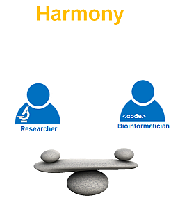

# Introduction

## Motivation {-}

Tercen  promotes collaboration for data analysis. Not everyone can code or even wants to,  but everyone should benefit from the explosion of data and code currently taking place.
Tercen allows non programmers (e.g. biologists) to explore their data and allows programmers (e.g. bioinformaticians) to upload their code (or web-apps) for the biologist to use. By offering this services we believe biologist get empowered and can claim back control of their data. The bioinformatician gets liberated from the operational details and  day to day analysis demands from the biologist. This is summed up with the phrase:

> Tercen __empowers__ the biologist and __liberates__ the bioinformatician.

## Challenges {-}

There are challenges for both the biologist and bioinformatician.

__Biologist's__ challenges:

* Get control of data
* Handle large data sizes
* Reduce analysis time
* Integrate external databases
* Visual Interaction

__Bioinformatician's__ challenges:

* Validate methodologies
* Improve analysis quality
* Educate biologists on statistical techniques
* Reduce time spent on IT support

## Way forward {-}

A new generation of tools and approaches are necessary. __TercenCloud__ aims to be such an approach. __TercenCloud__ is a platform where Biologist and Bioinformatics work easily together and upload, store and compute data.

A more harmonious state between the programmers and non-programmers is achieved using __TercenCloud__.

The following chapter gives a full overview of the features of __TercenCloud__.
