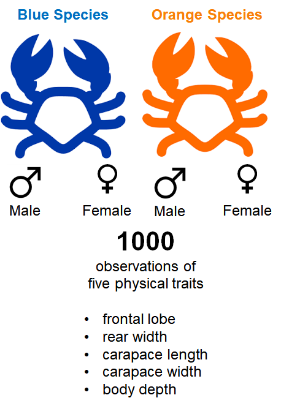
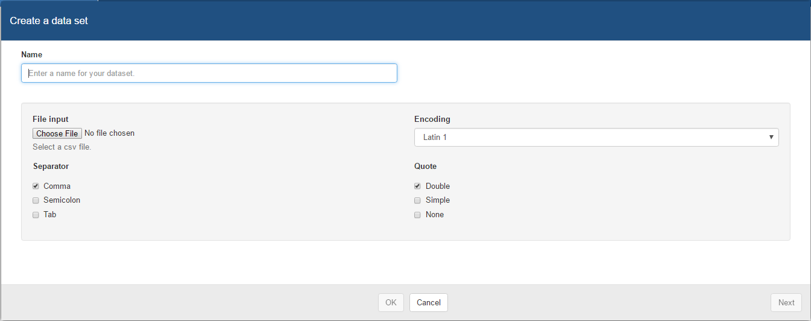
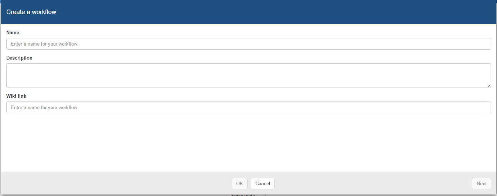
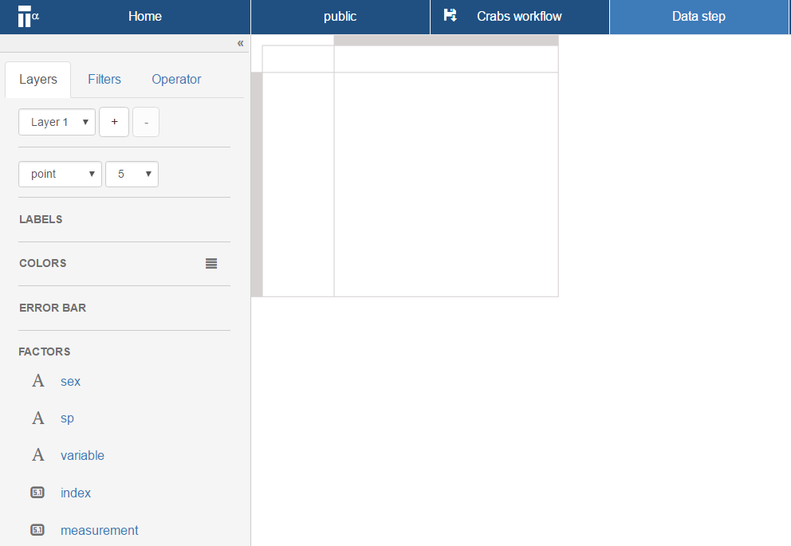
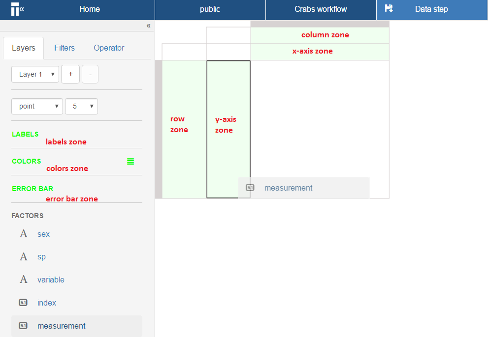
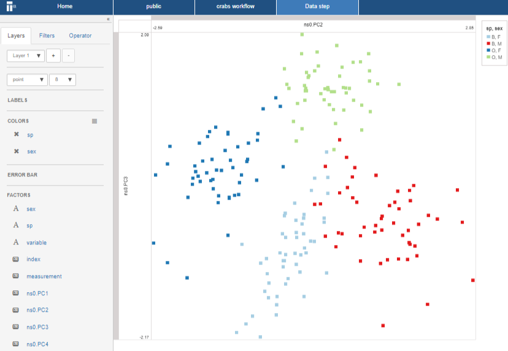
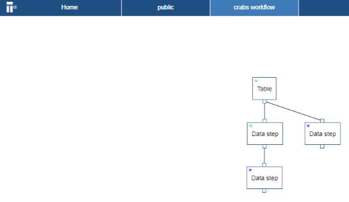

# Get started
This step-by-step guide outlines how to upload, view, compute and share data using TercenCloud.
it uses a data set of morphological  _measurements_ on _Leptograpsus Crabs_ collected at Fremantle, W. Australia.

## Get the data
The data set for this guide is available online as a git hub repository. It is found at https://github.com/tercen/getting_started/tree/master/crabs/data and download it to your local drive.

__Crab data description:__

The dataset is called "crabs" and it is in a _long format_. It is composed of four groups (two sexes and two species) of 50 measurements for five traits variables, ``FL`` (frontal lobe size in mm), ``RW`` (rear width mm), ``CL`` (carapace length mm), ``CW`` (carapace width mm) and ``BD`` (body depth mm). In summary it is:  

Factor|values
------|---
``sp`` |species, ``B`` or ``O`` for blue or orange.
``sex``|``M`` or ``F``
``index``|index 1 to 50 within each of the four groups, 2 sex and 2 species
``variable``|one of five variables: ``FL``, ``RW``, ``CL``, ``CW`` and ``BD``
``measurement``| the value of one of the five ``variable``

## Upload the data
In this section you upload an example data set.

_TercenCloud_ accepts data in either _.tsv_ or _csv_. These data set ``crabs_longformat.csv`` is in a _.csv_ and is in a _long format_.

### Go to the _project page_ by clicking on the ``public`` project

You may already have a personal project area, in which case go this project.

  
### Click on **Create a data set**

A dialog window opens which allows you to select the data file.

  
### Click on the **Choose File** button and select your file (i.e ``crabs_longformat.csv``).

Please make sure to select the separator, the encoding and the quote format.

Selecting the separator requires you to select one of three options:

* Comma (default)
* Semicolon
* Tab

Please select **Comma** for this dataset.

Selecting the encoding requires you to select one of two options:

* Latin 1 (default)
* UTF 8

Leave the default.

Selecting the quote requires you to select one of three options:

* Double (Default)
* Simple
* None

Leave the default..

### Click **Next**

You see what column headers were detected and their associated type.

### Click **OK**
You will now see the new data set in the _project page_.

## Creating a _workflow_
In this section you create a workflow.

### Go to the _project page_

  
### Click on **Create a workflow**

A dialog window opens which allows you to select the data file.

### Please fill in the **Name** with the name ``crab workflow`` 
The following information is possible:
* Name (Mandatory)
* Description (Optional)
* Wiki Link (Optional)

### Click **Next** and then click **OK**
You will now have an empty _workflow page_ titled ``Crab workflow`` you gave it.

### Right click in the _workflow page_  and select **Add step**

### Select **Table** and click **OK**
A new step named Table should appear on your _worklow page_.

### Right click on the Table step and select **Run**
A window appear allowing you to select the data sets which are available.
Select the crab data set you have uploaded.

### Select data set and click **OK**
The Table step should now be green.

You have now successfully imported you data sets into the workflow.

## Defining a view
In this section you create a visual.
Once you have imported your data into the workflow now you can configure a __projection__.

### Right click on the Table step and select **Add step**

### Select **Data step** and click **OK**.

Your workflow should look like:

### Double click on the data step
A _projection page_ opens

  
The _projection page_ is composed of different zones. The main zones are highlighted in green below:

You can create any projection by dragging-n-dropping of items in the _factors_ list to the different _zones_ (indicated by the color green) of the _projection page_. There are four _zones_ on the right and three on the left.

On the right are:

* _y-axis zone_
* _x-axis zone_
* _column zone_
* _row zone_

on the left are:

* _label zone_
* _colors zone_
* _error bar zone_

### Drag-n-drop the ``measurement`` factor to the y-axis zone

### Drag-n-drop the ``variable`` factor to the row zone

### Drag-n-drop the ``index`` and  ``sp`` and ``sex`` factor to the column zone

The image should look like the one above. Notice, the variable are the row and the observations are the columns.

### Drag-n-drop the ``measurement`` to colors zone

### Select ``heatmap`` in the drop down menu where it currently says ``point`` 

The projection window should now show the following:

## Computing
In this section you perform a computation.
The projection you created in the previous section can also be used by a computation (i.e. _operator_).
This is due to the _What you see is what you compute_ paradigm. The following steps outlines how to add an _operator_.

### Click on the **Operator** tab

### Go to the **Public tab** and select  the ``PCA`` operator, click **OK**

### Click on the save icon of the Data step page bar
The save icon (see red circle in figure below) will disappear once it is saved 

### Go to the workflow page

### Right click on the data step and select **Run**
The the data step status color will now go from blue to red (i.e in progress). Wait until the status goes to green (i.e completed).

## Visualizing the result
In this section you visualize the output of your previous PCA computation. The visual uses two principal components in a pair-wise plot.

### Right click on the data step and select **Add step** 

### Choose a **Data step** and click **OK**

### Open the newly created data step
A new projection page opens. This projection page should be familiar as you have seen this before in the previous steps of the this guide. However you will notice there are additional factors in the factor list, namely PC1, PC2, etc..

### Drag-n-drop the ``PC2`` factor to the _x-axis zone_
### Drag-n-drop the ``PC3`` factor to the _y-axis zone_
### Drag-n-drop the ``sex`` and ``species`` factor to the _colors zone_

## Visualizing a pairwise
In this section you create a multi-group pairwise visual.

### Click on the first data step and select **Add step** 

### Choose a **Data step** and click **OK**
This will create a second data step (see workflow screen shot below)

### Open the newly created data step
A new projection page opens. We will now create a pairwise projection of the ``variable``.

### Drag-n-drop the ``measurement`` factor to the _y-axis zone_
### Drag-n-drop the ``variable`` factor to the _column zone_
### Drag-n-drop the ``variable`` factor to the _row zone_
### Drag-n-drop the ``index`` factor to the _label zone_

This is the first pairwise projection, however these projection can be further developed into multi-group pariwise.

### Drag-n-drop the ``sex`` factor to the _column zone_
### Drag-n-drop the ``sp`` factor to the _color zone_

You have now completed the multi-group pairwise. This view is a powerful projection.

Your workflow should look like the following:

## Sharing the result
You will notice the each _data step_ (and hence visual) has its own unique URL and each _workflow_ has its own unique URL.
 
 https://tercen.com/core/#w/fa51aae551f7c3d14727ab5fd9b65433

This URL is for the crabs workflow found in the ``public`` project.
 
### Copy the url of the view with the multi-group plot
You can send this URL to another person by email or via a chat session.

 https://tercen.com/core/#ds/fa51aae551f7c3d14727ab5fd9b65433/2efff9f0-0f80-11e7-8de2-9fe5ab3cbd24

This URL is for the multi-group pairwise found in the workflow in the ``public`` project.

