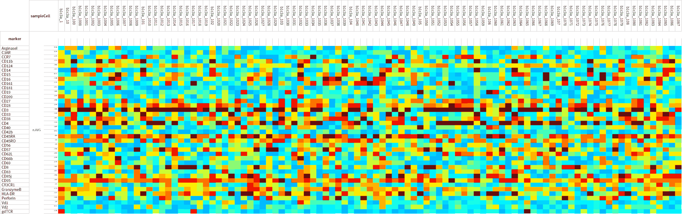
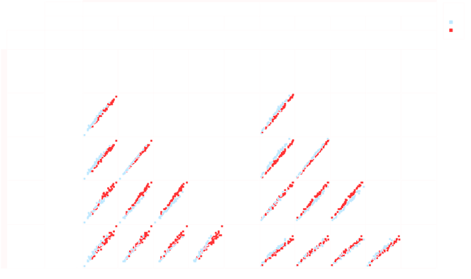
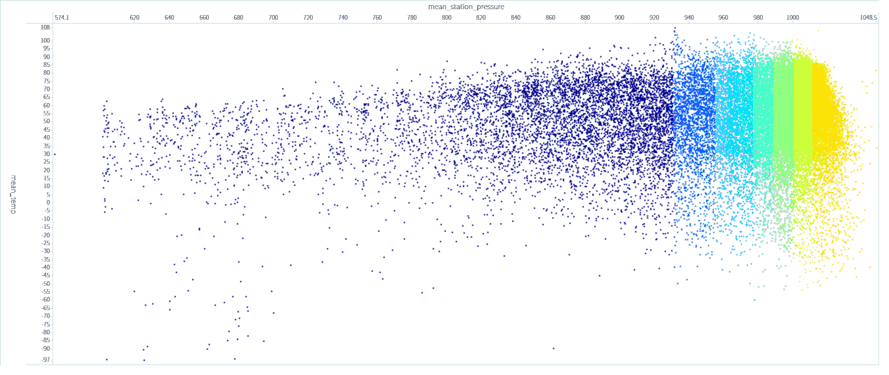
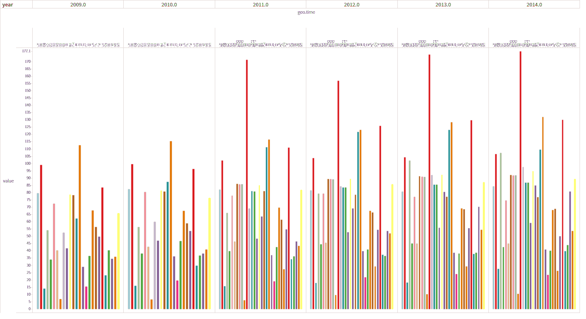
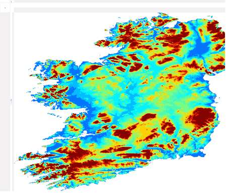

# Visualization

Researchers want to control the data they generate. Hence visualization of the data is key to getting an overview. In the overview, they search for known (e.g. effects) or unknown patterns (e.g. biases). The current classical tools (e.g. graphpad, excel) are not made to visualize large complex data sets. Tercen __cross tab  window__ allows researchers to interact and configure complex views.

## Cross-tab window

The __cross-tab window__ is opened by double clicking on a __data step__ in a __workflow__. The __cross-tab window__ allows the researchers to create any visual by dragging-n-dropping factors to the appropiate section of the cross-tab window.

The cross-tab windows is composed of six sections.

Section   | Location | Description |
:-----    | :------- |:------- |
`factor`  | top left     | shows the available factors
`filter`  | top middle   | defines the filters for the view in graph section
`layer`   | middle middle| defines the layers for the view in graph section
`namespace`| middle middle| defines the filters for the view in graph section
`run` | bottom middle| defines the filters for the view in graph section
`graph` | top right    | displays the resulting view

Researchers create a visual by drag-n-dropping factors from the `factor` section into one of seven zones : `row`, `column`, `x-axis`, `y-axis`, `color`, `label`, `error bar`.

Zone   |Section| Description |
:----- |:----- |:------- |
`row`    | graph| row dimension of graph|
`column`  | graph| column dimension of graph|
`x-axis` | graph| x-axis dimension of graph|
`y-axis`  | graph| y-axis dimension of graph|
`color` | layer| colored by the selected factor|
`label`  | layer|labelled by the selected factor|
`error bar`|layer| an error bar using the selected factor|

The factors are both the variables and annotations of your data (e.g. column headers in your uploaded data). The factors are dragged over to the zones in order to create the visualization or desired projection. Researchers may either create their own view or use an app pre-configured views. 

The cross-tab window also allows the concept of __layers__. A __layer__ allows the researcher to superimpose different views and build up sophisticated graphics. 

## Layers

__Layers__ are created in the cross-tab window. Each created __layer__ has the same __row__, __column__, __x-axis__ definition but allows the researcher to configure a different __y-axis__, __filter__, __color__, __label__ and __error bar__ which are all found in the `layer` section.

## Filters

__Filters__ are found in the `filter` zone of the cross-tab window. The filter allows the researcher to remove data from the view. A __filter__ is created, modified or deleted.
To create a filter you require to drag over a factor from the factor section to the filter section. The filter is configurable by double clicking on the filter itself. A previously defined filter may also be added by click on the `+` button. A list of previously defined filters appear and can be selected.

## Multi-pairwise

__Multi-pairwise__ is configured in the cross-tab window. It is created by dragging-n-dropping the same factor in the `row` zone and in the `column` zone. Note, a factor requires to be defined in the `label` zone. This allows the projection to know what factor separates data points in the pairwise plot. 

A typically configuration example is when researchers are comparing different gene measurements in different samples and wish to have a sample to sample pairwise plot. The factor (say `sample_id`), representing the sample, is placed in the `row` and `column` zone. The factor (say `measurement`) representing the values is placed in the `y-axis` zone. The factor (say `gene_id`), representing the different genes which were measured, is placed in the `label` zone.

## Examples

Here are a few examples of the configuration flexibility of the views.

__Heatmap__
View configuration: column, row, color, heatmap

  

__Multi Pairwise Plot__

  

__Profiles__

  

__Bar Plot__

  

__Single Scatter Plot__

  

__Maps__

  

